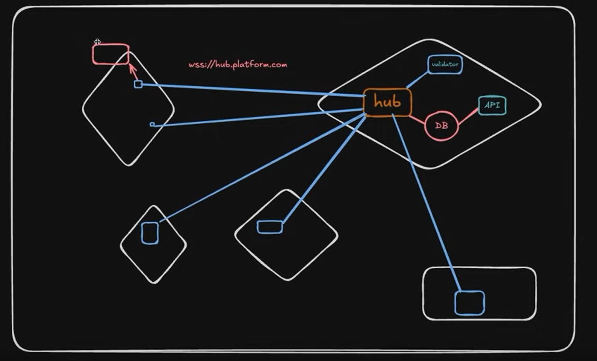
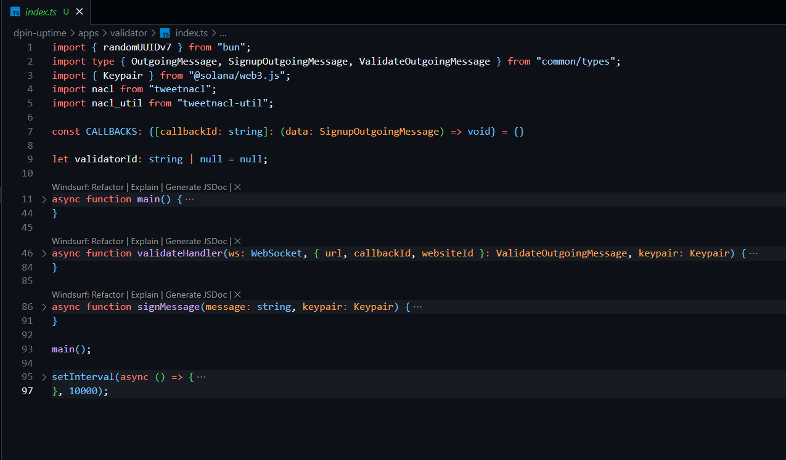

# DePIN Uptime Platform: Project Report

## Executive Summary

The DePIN Uptime Platform is a decentralized website monitoring solution that leverages blockchain technology to provide transparent, reliable, and incentivized uptime tracking. Unlike traditional centralized monitoring services, our platform distributes monitoring responsibilities across multiple independent nodes that verify website statuses through a consensus mechanism, recording results immutably on the Ethereum blockchain.

Key features include:
- Decentralized monitoring through independent validator nodes
- Transparent on-chain storage of monitoring results
- Economic incentives for honest reporting through token rewards
- Reputation system for validator accountability
- User-friendly frontend for website owners and node operators

The platform addresses common limitations of traditional monitoring services, such as single points of failure, lack of transparency, and alignment of incentives. By creating a network of independent validators with economic incentives for accurate reporting, the DePIN Uptime Platform aims to achieve improved accuracy (targeting 99.5%) and cost efficiency (30% reduction compared to conventional services) while providing tamper-proof monitoring records.

## Project Background and Motivation

### The Problem

Traditional uptime monitoring services have several inherent limitations:

1. **Single Points of Failure**: Centralized monitoring services can themselves go down, leading to monitoring gaps
2. **Limited Geographical Coverage**: Most services operate from a limited number of locations
3. **Lack of Transparency**: Website owners must trust the monitoring service's reporting without independent verification
4. **Incentive Misalignment**: Traditional services lack direct economic incentives for accurate reporting
5. **Centralized Control**: Monitoring providers can modify historical data or reporting parameters

### The Solution: Decentralized Physical Infrastructure Networks (DePIN)

DePIN represents a paradigm shift in how physical and digital infrastructure services are provided. Rather than relying on centralized providers, DePIN solutions leverage networks of independent operators who contribute resources to a decentralized network, receiving token-based incentives for their participation.

The DePIN Uptime Platform applies this model to website monitoring by:

1. **Decentralizing the Monitoring Infrastructure**: Multiple independent nodes across diverse geographical locations
2. **Ensuring Data Integrity**: Recording monitoring results immutably on the blockchain
3. **Aligning Economic Incentives**: Rewarding nodes for accurate reporting with native tokens
4. **Implementing Consensus Mechanisms**: Using multiple validators to agree on website status
5. **Building a Reputation System**: Tracking validator reliability over time

By combining blockchain technology with distributed monitoring nodes, the platform creates a more robust, transparent, and economically sustainable approach to website uptime monitoring.

## Technical Architecture

### System Overview

The DePIN Uptime Platform consists of three main components:

1. **Smart Contracts**: The backbone of the platform, running on the Ethereum blockchain
2. **Frontend Application**: User interface for website owners and node operators
3. **Node Client**: Software run by validators to check website status and report to the blockchain



### Smart Contracts Architecture

The platform uses a set of modular smart contracts, each with specific responsibilities:

1. **WebsiteRegistry**: Manages website registrations and stores metadata
2. **NodeRegistry**: Handles validator node registrations and tracks node statistics
3. **StatusReport**: Stores website status reports submitted by validator nodes
4. **ConsensusEngine**: Processes reports from multiple validators to determine consensus status
5. **ReputationSystem**: Tracks validator reliability based on agreement with consensus
6. **RewardDistribution**: Handles token rewards for validators based on reporting accuracy
7. **UptimeToken**: ERC-20 token used for rewards and governance

The contracts interact as follows:

- Website owners register their sites in the **WebsiteRegistry**
- Node operators register in the **NodeRegistry**
- Nodes submit status reports to the **StatusReport** contract
- The **ConsensusEngine** processes reports to determine the agreed status
- The **ReputationSystem** updates node reputation scores based on consensus agreement
- The **RewardDistribution** contract allocates tokens to nodes based on accurate reporting

### Frontend Architecture

The frontend is built with React and Material UI, providing separate interfaces for:

- Website owners to register and monitor their websites
- Node operators to manage their validator nodes
- System dashboard for overall statistics and platform status

Key frontend components include:

- **Web3 Integration**: Connects to Ethereum wallets like MetaMask
- **Contract Service Layer**: Abstracts blockchain interactions
- **Data Visualization**: Displays uptime statistics and performance metrics
- **UI Components**: Consistent design system for a seamless user experience

### Node Client Architecture

The node client is a command-line application built with Node.js that:

1. Registers itself with the NodeRegistry contract
2. Retrieves active websites from the WebsiteRegistry
3. Performs HTTP requests to check website status
4. Submits status reports to the StatusReport contract
5. Tracks its own performance metrics

The client uses a configurable checking interval and supports various operational modes for different validation scenarios.

## Implementation Details

### Smart Contracts Implementation

The smart contracts are implemented in Solidity 0.8.20 and use OpenZeppelin's libraries for standard functionalities. Key implementation highlights include:

#### WebsiteRegistry Contract

```solidity
struct Website {
    string url;
    string name;
    address owner;
    bool active;
    uint256 registrationTime;
    uint256 lastCheckTime;
}
```

The contract tracks website metadata and provides functions for registration, updates, and queries.

#### NodeRegistry Contract

```solidity
struct Node {
    string name;
    string endpoint;
    address owner;
    bool active;
    uint256 registrationTime;
    uint256 lastReportTime;
    uint256 reportsSubmitted;
}
```

The contract manages node information and provides functions for registration, updates, and performance tracking.

#### StatusReport Contract

```solidity
enum Status {
    Unknown,    // 0: Status unknown or not reported
    Online,     // 1: Website is online and responding
    Offline,    // 2: Website is offline or not responding
    Degraded    // 3: Website is responding but with issues
}

struct Report {
    uint256 websiteId;
    uint256 nodeId;
    Status status;
    uint256 responseTime;
    uint256 timestamp;
    string statusMessage;
}
```

The contract stores reports from validator nodes and provides query functions for retrieving historical data.

### Frontend Implementation

The frontend is built with:

- React for component-based UI
- Vite as the build tool
- Material UI for consistent styling
- ethers.js for blockchain interactions
- React Router for navigation
- Chart.js for data visualization

Key frontend pages include:

1. **Home**: Platform introduction and overview
2. **Dashboard**: Statistical overview of registered websites and nodes
3. **Website Owner**: Interface for registering and managing websites
4. **Node Operator**: Interface for registering and managing validator nodes

The frontend implements a responsive design that works across desktop and mobile devices, with loading states, error handling, and feedback mechanisms for blockchain operations.

### Node Client Implementation

The node client is built with:

- Node.js as the runtime environment
- Commander.js for CLI argument parsing
- ethers.js for blockchain interactions
- Axios for HTTP requests
- winston for logging

Key capabilities include:

1. **Node Registration**: Register a new validator node
2. **Status Checking**: Check website status and submit reports
3. **Automatic Monitoring**: Run in daemon mode to check websites at regular intervals
4. **Performance Tracking**: Monitor and report on node statistics

## Key Features and Capabilities

### For Website Owners

1. **Website Registration**: Register websites for monitoring
2. **Status Dashboard**: Real-time view of website status across all validators
3. **Historical Data**: Access to historical uptime data and trends
4. **Alerting**: Configurable alerts for status changes
5. **Performance Metrics**: Response time and availability statistics

### For Node Operators

1. **Node Registration**: Easy setup and registration process
2. **Rewards**: Token rewards for accurate reporting
3. **Reputation Building**: Build node reputation through reliable reporting
4. **Performance Dashboard**: Track node performance and reward metrics
5. **Automated Operation**: Set-and-forget monitoring capabilities

### Platform Features

1. **Consensus Mechanism**: Multi-validator agreement on website status
2. **Reputation System**: Track and reward reliable validators
3. **Token Economics**: Incentives for honest reporting
4. **Transparent Records**: Immutable on-chain history of website status
5. **Decentralized Governance**: Token-based voting on platform parameters (future feature)

## Challenges Faced and Solutions

### 1. Contract Deployment and Address Synchronization

**Challenge**: Ensuring consistent contract addresses across frontend and node client components.

**Solution**: Created an automated deployment script that updates address configuration files for all components, ensuring synchronization and preventing connection errors.

### 2. Frontend-Contract Interface Alignment

**Challenge**: Ensuring frontend service calls matched contract method signatures.

**Solution**: Implemented interface validation tests to catch mismatches, and updated frontend services to correctly align with contract interfaces.

### 3. Error Handling and User Feedback

**Challenge**: Providing meaningful feedback for blockchain operations that may take time to complete.

**Solution**: Enhanced transaction error reporting, improved logging, and implemented a transaction status monitoring system with user-friendly status indicators.

### 4. Performance Optimization

**Challenge**: The dashboard experienced performance issues with multiple contract calls.

**Solution**: Implemented contract instance caching, optimized component rendering, added data caching layers, and implemented timeout protection with graceful fallbacks.

### 5. UI/UX for Blockchain Interactions

**Challenge**: Creating an intuitive interface for blockchain operations that may be unfamiliar to users.

**Solution**: Developed a consistent design system with clear status indicators, loading states, and feedback mechanisms, plus a wallet connection component with network information.

## Future Enhancements

### 1. Multi-Chain Support

Expand the platform to operate across multiple blockchain networks, allowing users to choose their preferred network for cost and performance optimization.

### 2. Advanced Consensus Mechanisms

Implement more sophisticated consensus algorithms that account for geographical distribution and historical accuracy of validators.

### 3. Governance Framework

Introduce a token-based governance system for platform parameters, allowing token holders to vote on key decisions like reward distribution and validation requirements.

### 4. Enhanced Validation Capabilities

Expand monitoring capabilities beyond simple uptime to include performance metrics, SSL certificate validation, content verification, and more.

### 5. Mobile Applications

Develop native mobile applications for website owners and node operators to receive real-time alerts and manage their accounts on the go.

## Conclusion

The DePIN Uptime Platform represents a significant advancement in website monitoring by applying blockchain technology and decentralized infrastructure principles to address limitations in traditional monitoring solutions. By distributing monitoring across independent validators, creating economic incentives for honest reporting, and storing results immutably on the blockchain, the platform offers a more transparent, reliable, and equitable approach to uptime tracking.

The completed project demonstrates the viability of using decentralized physical infrastructure networks for real-world applications beyond cryptocurrency. The implementation successfully combines smart contracts, a user-friendly frontend, and an efficient node client to create a cohesive monitoring ecosystem that benefits all participants.

As the project evolves, further enhancements in governance, validation capabilities, and cross-chain compatibility will expand its utility and adoption potential, potentially establishing a new standard for decentralized infrastructure services.

## Appendices

### Appendix A: Technical Requirements

- **Frontend**: Node.js v16+, NPM v8+, React, Material UI
- **Smart Contracts**: Solidity 0.8.20, Hardhat development environment
- **Node Client**: Node.js v16+, NPM v8+
- **User Requirements**: MetaMask or compatible Ethereum wallet

### Appendix B: Contract Addresses

Local development environment default addresses:
- NodeRegistry: 0x5FbDB2315678afecb367f032d93F642f64180aa3
- StatusReport: 0xe7f1725E7734CE288F8367e1Bb143E90bb3F0512
- WebsiteRegistry: 0x9fE46736679d2D9a65F0992F2272dE9f3c7fa6e0
- ReputationSystem: 0xCf7Ed3AccA5a467e9e704C703E8D87F634fB0Fc9
- RewardDistribution: 0xDc64a140Aa3E981100a9becA4E685f962f0cF6C9

### Appendix C: Setup Instructions

See the comprehensive [SETUP.md](../SETUP.md) file for detailed installation and configuration instructions.

### Appendix D: User Workflows

#### Website Owner Workflow

1. Connect MetaMask wallet to the platform
2. Navigate to Website Owner section
3. Register website with URL, name, and check frequency
4. View website status on Dashboard
5. Receive notifications for status changes

#### Node Operator Workflow

1. Connect MetaMask wallet to the platform
2. Navigate to Node Operator section
3. Register node with name and endpoint
4. Set up node client with configuration details
5. Start automated website checking
6. Earn rewards for accurate reporting

### Appendix E: Screenshots


 