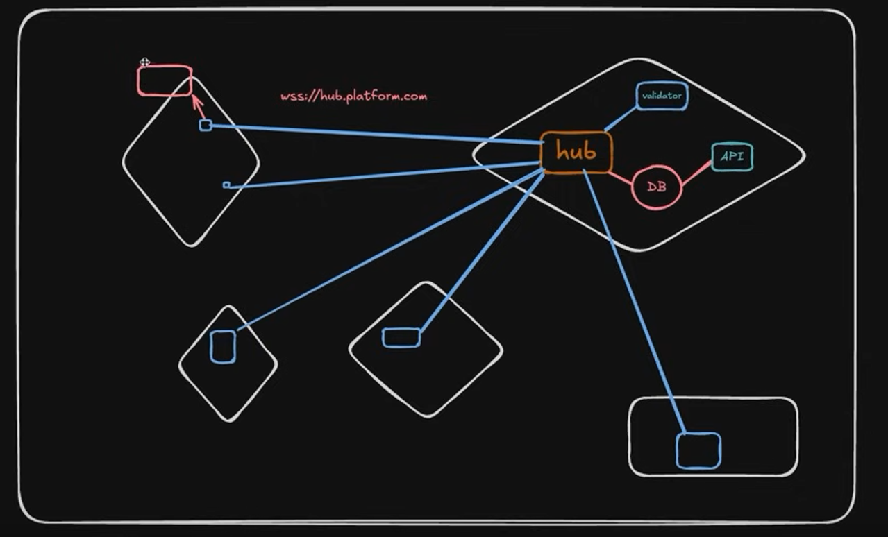
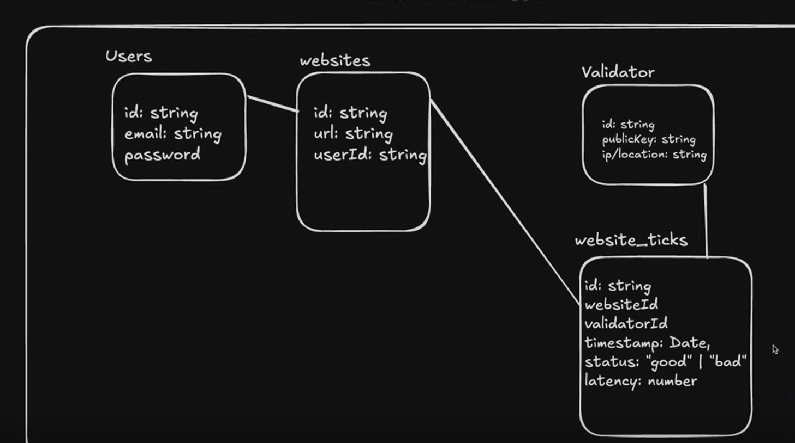

# DePIN Uptime Platform: Technical Architecture

This document provides a comprehensive overview of the technical architecture of the DePIN Uptime Platform, including component relationships, data flow, and design decisions.

## System Architecture Overview

The DePIN Uptime Platform is built on a three-tier architecture:

1. **Blockchain Layer**: Smart contracts deployed on Ethereum
2. **Application Layer**: Frontend web application and node client
3. **Infrastructure Layer**: Validator nodes and Ethereum network



### Architecture Components

| Component | Type | Description |
|-----------|------|-------------|
| Smart Contracts | Blockchain | Solidity contracts deployed on Ethereum |
| Frontend | Web Application | React/Vite application for user interactions |
| Node Client | CLI Application | Node.js client for website verification |
| MetaMask | Wallet | User wallet for blockchain interactions |
| Ethereum Network | Blockchain | Underlying blockchain infrastructure |

## Smart Contract Architecture

The smart contract architecture follows a modular design pattern with specialized contracts for specific functionalities:



### Contract Components

1. **WebsiteRegistry**
   - Manages website registrations
   - Stores website metadata (URL, name, owner)
   - Tracks website active status

2. **NodeRegistry**
   - Manages validator node registrations
   - Stores node metadata (name, endpoint, owner)
   - Tracks node statistics and reporting history

3. **StatusReport**
   - Stores website status reports from validators
   - Provides query functions for report history
   - Defines status codes and reporting structure

4. **ConsensusEngine**
   - Processes reports from multiple validators
   - Applies consensus algorithm to determine agreed status
   - Filters outliers and inconsistent reports

5. **ReputationSystem**
   - Tracks validator reliability scores
   - Updates reputation based on consensus agreement
   - Provides reputation data for reward calculation

6. **RewardDistribution**
   - Calculates token rewards for validators
   - Distributes tokens based on reporting accuracy
   - Implements incentive mechanisms

7. **UptimeToken**
   - ERC-20 token implementation
   - Used for rewards and governance

### Contract Interactions

The contracts interact in the following manner:

1. Website owners register websites in **WebsiteRegistry**
2. Node operators register nodes in **NodeRegistry**
3. Validator nodes submit status reports to **StatusReport**
4. **ConsensusEngine** processes reports periodically to determine consensus
5. **ReputationSystem** updates node reputation based on consensus alignment
6. **RewardDistribution** allocates tokens based on reputation and activity
7. **UptimeToken** transfers are triggered for reward payments

### Data Structure

Key data structures in the smart contracts include:

#### Website Structure
```solidity
struct Website {
    string url;          // Website URL to monitor
    string name;         // Website name
    address owner;       // Owner's Ethereum address
    bool active;         // Active status
    uint256 registrationTime; // When website was registered
    uint256 lastCheckTime;    // Last status check time
}
```

#### Node Structure
```solidity
struct Node {
    string name;         // Node name
    string endpoint;     // Node API endpoint
    address owner;       // Owner's Ethereum address
    bool active;         // Active status
    uint256 registrationTime; // When node was registered
    uint256 lastReportTime;   // Last report submission time
    uint256 reportsSubmitted; // Total number of reports
}
```

#### Report Structure
```solidity
struct Report {
    uint256 websiteId;   // Website identifier
    uint256 nodeId;      // Node identifier
    Status status;       // Status code (enum)
    uint256 responseTime; // Response time in milliseconds
    uint256 timestamp;    // Report submission time
    string statusMessage; // Additional status information
}
```

## Frontend Architecture

The frontend application follows a component-based architecture using React and Material UI.

### Component Structure

```
frontend/
├── src/
│   ├── components/       # Reusable UI components
│   ├── contracts/        # Contract ABIs and addresses
│   ├── pages/            # Page components
│   ├── services/         # Service layer for API/contract interactions
│   ├── App.jsx           # Main application component
│   ├── index.css         # Global styles
│   ├── main.jsx          # Application entry point
│   └── theme.js          # UI theme configuration
```

### Key Components

1. **Web3Provider**: Manages blockchain connection and wallet state
2. **ContractService**: Abstracts smart contract interactions
3. **Dashboard**: Displays platform statistics and status
4. **WebsiteRegistration**: Form for registering websites
5. **NodeRegistration**: Form for registering validator nodes
6. **StatusMonitor**: Real-time status display for websites
7. **MetricsDisplay**: Charts and graphs for performance metrics

### Data Flow

1. User connects wallet via MetaMask
2. Frontend loads contract ABIs and addresses
3. User interacts with UI components
4. Component calls appropriate service method
5. Service executes contract interactions
6. Contract events trigger UI updates
7. Success/error feedback displayed to user

### State Management

The frontend uses React's context API for global state management:

- **Web3Context**: Manages wallet connection and network state
- **ContractContext**: Provides access to contract instances
- **UIContext**: Manages UI state (loading, errors, notifications)

## Node Client Architecture

The node client is a command-line application implemented in Node.js.

### Component Structure

```
node-client/
├── commands/          # Command implementations
├── contracts/         # Contract ABIs and utilities
├── services/          # Service layer
├── utils/             # Utility functions
├── index.js           # Main entry point
└── config.js          # Configuration management
```

### Key Components

1. **CommandManager**: Parses and routes CLI commands
2. **WebsiteService**: Interacts with WebsiteRegistry contract
3. **ReportService**: Submits reports to StatusReport contract
4. **StatusChecker**: Performs HTTP requests to check website status
5. **Logger**: Handles logging to console and file

### Operational Flow

1. Node operator registers node through CLI or frontend
2. Node client retrieves registered websites from WebsiteRegistry
3. Client performs HTTP requests to check website status
4. Status results are processed and formatted as reports
5. Reports are submitted to the StatusReport contract
6. Logs are generated for monitoring and debugging

## Security Model

The platform implements multiple security measures:

1. **Ownership Controls**: Contracts use OpenZeppelin's Ownable pattern
2. **Access Controls**: Functions verify caller permissions
3. **Input Validation**: All inputs are validated before processing
4. **Reputation System**: Discourages malicious reporting
5. **Economic Incentives**: Rewards honest behavior
6. **Consensus Requirements**: Multiple validators must agree on status

## System Constraints and Requirements

### Hardware Requirements

- **Frontend**: Any modern web browser
- **Node Client**: Minimal server with Node.js support
- **Smart Contracts**: Access to Ethereum node

### Software Requirements

- **Frontend**: Node.js v16+, NPM v8+
- **Node Client**: Node.js v16+, NPM v8+
- **Smart Contracts**: Solidity 0.8.20, Hardhat development environment

### Network Requirements

- **Ethereum Network**: Access to Ethereum node (Hardhat for local development)
- **Website Checking**: Outbound HTTP/HTTPS access for validators

## Design Decisions and Trade-offs

### Blockchain Selection

**Decision**: Ethereum was chosen as the blockchain platform.

**Rationale**:
- Mature smart contract ecosystem
- Strong developer support and tools
- Well-established security practices
- Support for ERC-20 tokens

**Trade-offs**:
- Gas costs can be high on mainnet
- Transaction confirmation times
- Scalability limitations

### Consensus Mechanism

**Decision**: Multi-validator weighted consensus with reputation factors.

**Rationale**:
- Balances input from multiple sources
- Accounts for validator reliability history
- Resistant to individual node failures or manipulation

**Trade-offs**:
- Requires minimum number of active validators
- Computational complexity increases with validator count
- Potential for majority collusion (mitigated by reputation)

### On-chain vs. Off-chain Storage

**Decision**: Status reports stored on-chain, detailed metrics stored off-chain.

**Rationale**:
- Critical status data maintained on-chain for transparency
- Detailed metrics stored off-chain to reduce gas costs
- Balances transparency with efficiency

**Trade-offs**:
- Gas costs for report storage
- Limited metrics detail on-chain
- Dependency on off-chain storage for detailed history

### Token Economics

**Decision**: Native ERC-20 token for rewards with reputation multiplier.

**Rationale**:
- Creates economic incentives for honest reporting
- Reputation amplifies rewards to encourage consistency
- Token governance creates stakeholder alignment

**Trade-offs**:
- Token price volatility affects incentive strength
- Initial token distribution and bootstrapping
- Governance mechanism complexity

## Future Architectural Considerations

### Layer 2 Integration

To address scalability and gas cost concerns, future versions may integrate with Ethereum Layer 2 solutions like Optimism, Arbitrum, or ZK-rollups.

### Cross-chain Compatibility

To provide flexibility, the platform may be extended to support multiple blockchain networks through a bridge architecture or multi-chain deployment.

### Decentralized Storage Integration

Future versions may integrate with decentralized storage solutions like IPFS or Arweave for more efficient storage of detailed metrics and historical data.

### Enhanced Validation Protocol

The validation protocol may be expanded to include more sophisticated checks and multi-dimensional status reporting beyond simple up/down monitoring.

### Validator Node Federation

A federation mechanism could be implemented to allow validator nodes to form trusted groups with specialized reputations for specific monitoring tasks.

## Conclusion

The DePIN Uptime Platform architecture has been designed to create a decentralized, transparent, and economically sustainable approach to website monitoring. By combining blockchain technology with distributed validator nodes, the system addresses fundamental limitations of traditional centralized monitoring services while creating new opportunities for participation and innovation.

The modular contract design, component-based frontend, and flexible node client provide a solid foundation for future enhancements while delivering immediate value to website owners and node operators in the current implementation. 