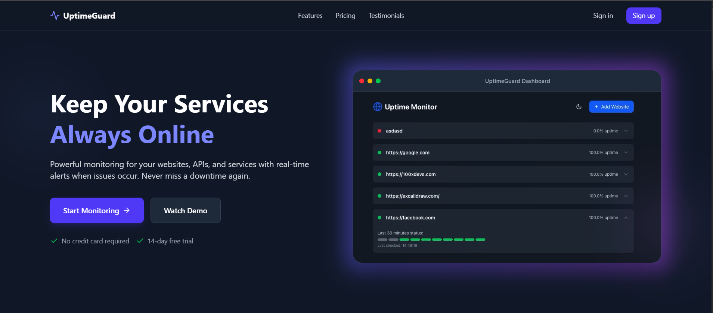
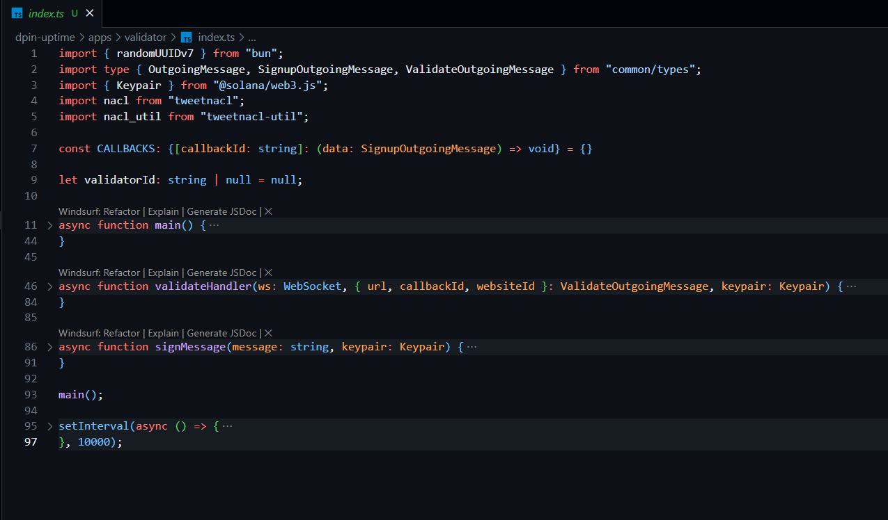
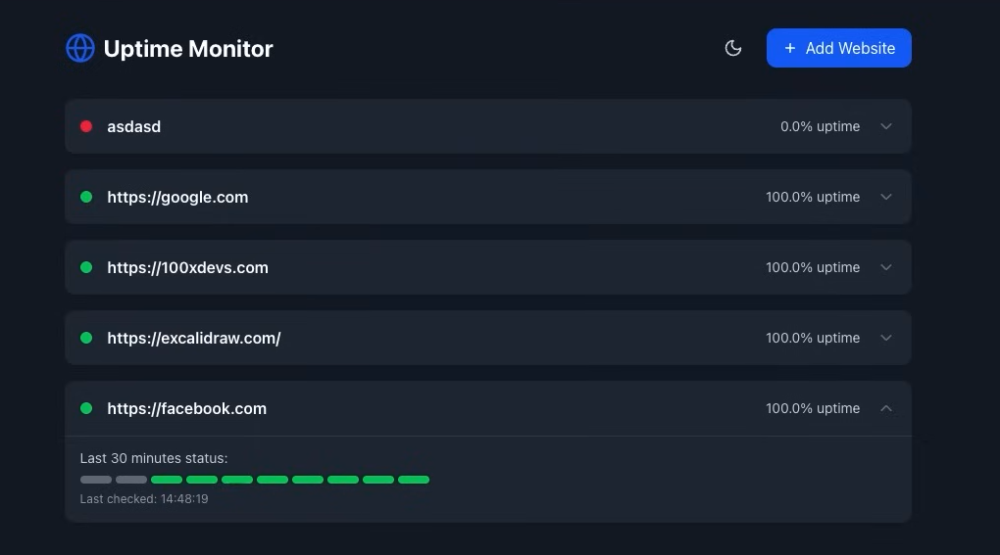

# DePIN Uptime Platform: User Guide

This user guide provides detailed instructions for using the DePIN Uptime Platform, including setup, configuration, and common tasks.

## Table of Contents

1. [Introduction](#introduction)
2. [Getting Started](#getting-started)
3. [Website Owner Guide](#website-owner-guide)
4. [Node Operator Guide](#node-operator-guide)
5. [Dashboard Guide](#dashboard-guide)
6. [Troubleshooting](#troubleshooting)
7. [FAQ](#faq)

## Introduction

The DePIN Uptime Platform is a decentralized website monitoring solution that leverages blockchain technology to provide transparent, reliable uptime tracking. The platform connects website owners with independent validator nodes that monitor website availability and record results on the Ethereum blockchain.

### Key Features

- **Decentralized Monitoring**: Multiple independent nodes verify website status
- **Transparent Reporting**: All status reports are stored on the blockchain
- **Token Incentives**: Node operators earn tokens for accurate reporting
- **Real-time Dashboard**: View website status and performance metrics
- **Reputation System**: Node reliability is tracked and rewarded

### User Roles

The platform supports two primary user roles:

1. **Website Owners**: Register websites for monitoring
2. **Node Operators**: Run validator nodes to check website status

Both roles interact with the platform through a web-based frontend and require an Ethereum wallet (like MetaMask) for blockchain interactions.

## Getting Started

### System Requirements

- A modern web browser (Chrome, Firefox, Edge)
- MetaMask or compatible Ethereum wallet
- For node operators: Node.js v16+ and NPM v8+

### Setting Up Your Wallet

1. Install the [MetaMask extension](https://metamask.io/) for your browser
2. Create a new wallet or import an existing one
3. Add the appropriate network to MetaMask:
   - For local development: Add the Hardhat network
     - Network Name: Hardhat Local
     - RPC URL: http://127.0.0.1:8545/
     - Chain ID: 31337
     - Currency Symbol: ETH

### Connecting to the Platform

1. Open the DePIN Uptime Platform in your browser
2. Click the "Connect Wallet" button in the top-right corner
3. Select your MetaMask account when prompted
4. Once connected, your wallet address will appear in the header



## Website Owner Guide

As a website owner, you can register your websites for monitoring and view their status on the platform.

### Registering a Website

1. Navigate to the "Website Owner" section from the main menu
2. Fill out the registration form:
   - **Website Name**: A descriptive name for your website
   - **URL**: The complete URL to monitor (e.g., https://example.com)
   - **Description**: Optional details about your website
   - **Check Frequency**: How often the website should be checked (in minutes)
3. Click "Register Website"
4. Confirm the transaction in MetaMask
5. Wait for the transaction to be confirmed on the blockchain

### Managing Websites

After registering websites, you can manage them from the Website Owner dashboard:

1. View all your registered websites
2. Check their current status across all validators
3. Toggle website active status by clicking the switch
4. Update website details by clicking the edit icon
5. View detailed monitoring history by clicking on a website

### Website Settings

For each registered website, you can configure additional settings:

1. **Notification Settings**: Configure alerts for status changes
2. **Check Frequency**: Adjust how often the website is checked
3. **Active/Inactive**: Temporarily disable monitoring without deleting the registration

## Node Operator Guide

As a node operator, you run validator nodes that check website status and earn rewards for accurate reporting.

### Registering a Node

1. Navigate to the "Node Operator" section from the main menu
2. Fill out the registration form:
   - **Node Name**: A name for your validator node
   - **Endpoint**: The URL where your node can be reached
3. Click "Register Node"
4. Confirm the transaction in MetaMask
5. Wait for the transaction to be confirmed
6. Note your assigned Node ID for use with the node client



### Setting Up the Node Client

1. Clone the repository and navigate to the node-client directory:
   ```bash
   git clone https://github.com/your-repo/dpin-uptime.git
   cd dpin-uptime/node-client
   ```

2. Install dependencies:
   ```bash
   npm install
   ```

3. Create a `.env` file with your configuration:
   ```
   # Ethereum node RPC URL (Hardhat local node)
   RPC_URL=http://localhost:8545

   # Private key for the node operator account
   PRIVATE_KEY=your_private_key_here

   # Contract addresses (these will be set by the deployment script)
   NODE_REGISTRY_ADDRESS=0x5FbDB2315678afecb367f032d93F642f64180aa3
   STATUS_REPORT_ADDRESS=0xe7f1725E7734CE288F8367e1Bb143E90bb3F0512
   WEBSITE_REGISTRY_ADDRESS=0x9fE46736679d2D9a65F0992F2272dE9f3c7fa6e0
   REPUTATION_SYSTEM_ADDRESS=0xCf7Ed3AccA5a467e9e704C703E8D87F634fB0Fc9
   REWARD_DISTRIBUTION_ADDRESS=0xDc64a140Aa3E981100a9becA4E685f962f0cF6C9

   # Node settings
   NODE_NAME=MyNodeName
   NODE_ENDPOINT=http://mynode.example.com
   NODE_ID=your_assigned_node_id

   # Monitoring settings
   CHECK_INTERVAL=5
   TIMEOUT_MS=5000
   LOG_LEVEL=info
   ```

4. If you haven't registered your node through the frontend, register it via the CLI:
   ```bash
   node index.js register --name "MyNode" --endpoint "http://mynode.example.com"
   ```

5. Start monitoring websites:
   ```bash
   node index.js start --interval 5 --node-id YOUR_NODE_ID
   ```

### Node Client Commands

The node client supports the following commands:

- **Register**: Register a new node
  ```bash
  node index.js register --name "NodeName" --endpoint "http://endpoint.example.com"
  ```

- **Check**: Check a specific website
  ```bash
  node index.js check --website-id 0 --node-id 0
  ```

- **Start**: Begin automatic checking of all websites
  ```bash
  node index.js start --interval 5 --node-id 0
  ```

- **Status**: Get your node's current status
  ```bash
  node index.js status --node-id 0
  ```

### Monitoring Your Node

The node client generates logs in the `node-client.log` file. You can monitor these logs to track your node's activity:

```bash
tail -f node-client.log
```

You can also view your node's performance in the Node Operator dashboard on the frontend, including:

- Total reports submitted
- Reputation score
- Reward tokens earned
- Agreement rate with consensus

## Dashboard Guide

The platform dashboard provides an overview of all monitoring activity and system statistics.

### Dashboard Features

1. **Website Status Overview**: Current status of all registered websites
2. **Node Performance**: Statistics on validator node performance
3. **System Metrics**: Platform-wide metrics and trends
4. **Recent Reports**: Latest status reports from validators



### Using the Dashboard

1. **Filter Options**: Use the filters to view specific websites or nodes
2. **Time Range**: Adjust the time range for historical data
3. **Detailed View**: Click on any entity to see detailed information
4. **Export**: Export data in various formats for offline analysis

### Data Visualizations

The dashboard includes several data visualizations:

1. **Status Timeline**: Website status over time
2. **Response Time Graph**: Performance trends
3. **Validator Agreement**: Consensus visualization
4. **Geographical Distribution**: Node location map

## Troubleshooting

### Common Issues

#### Wallet Connection Issues

**Problem**: Cannot connect MetaMask to the platform.

**Solutions**:
1. Ensure MetaMask is installed and unlocked
2. Check that you're connected to the correct network
3. Refresh the page and try connecting again
4. Clear browser cache and reconnect

#### Transaction Failures

**Problem**: Transactions fail or remain pending.

**Solutions**:
1. Check your account has sufficient ETH for gas
2. Ensure you're connected to the correct network
3. Try increasing the gas limit in MetaMask
4. Check the console for error messages

#### Node Client Issues

**Problem**: Node client cannot connect to contracts.

**Solutions**:
1. Verify contract addresses in your .env file
2. Ensure your private key is correct
3. Check that the Ethereum node is accessible
4. Confirm your node ID is correct

#### Website Status Reporting Issues

**Problem**: Website status not updating or incorrect.

**Solutions**:
1. Check the website URL is correct and accessible
2. Ensure your node has internet access
3. Verify that your node is registered and active
4. Check the node-client.log for errors

### Getting Help

If you encounter issues not covered here:

1. Check the project GitHub repository for known issues
2. Join the community Discord for peer support
3. Submit detailed bug reports with reproduction steps
4. For node issues, include relevant logs from node-client.log

## FAQ

### General Questions

#### Q: How does the platform ensure accurate reporting?
A: The platform uses multiple independent validators and applies a consensus mechanism to determine the actual website status. Validators earn reputation based on agreement with consensus, and rewards are distributed according to reputation and activity.

#### Q: Is my website data public?
A: Yes, all website registrations and status reports are stored on the public Ethereum blockchain for transparency. However, no sensitive data beyond the URL and name is stored on-chain.

#### Q: Can I use the platform on public Ethereum networks?
A: Yes, the platform can be deployed to any Ethereum-compatible network, including Ethereum mainnet, testnets, or other EVM-compatible chains like Polygon or BSC.

### Website Owner Questions

#### Q: How many validators check my website?
A: All active validators on the platform will check your website according to the specified check frequency.

#### Q: How can I get notified of status changes?
A: The platform supports email and webhook notifications for status changes. These can be configured in the website settings after registration.

#### Q: Can I temporarily disable monitoring?
A: Yes, you can toggle the active status of your website without removing it from the registry.

### Node Operator Questions

#### Q: How are rewards calculated?
A: Rewards are calculated based on:
1. Number of accurate reports (matching consensus)
2. Your node's reputation score
3. Total active time

#### Q: Do I need to stake tokens to operate a node?
A: In the current implementation, staking is not required. Future versions may implement a staking mechanism for additional security.

#### Q: Can I run multiple validator nodes?
A: Yes, you can register and operate multiple nodes from different locations to earn more rewards and improve geographical coverage.

#### Q: What happens if my node reports incorrectly?
A: If your node consistently reports statuses that differ from consensus, your reputation score will decrease, resulting in lower rewards. Severe or malicious misreporting could result in disqualification. 